# Evidencias

## 1. Endpoints consumidos desde Swagger

Pruebas realizadas en Swagger UI (`http://127.0.0.1:8000/api/documentation`) con el usuario de prueba `cliente@example.com`, autenticado con el token Bearer que devuelve el inicio de sesión.

### Inicio de sesión: `POST /api/login`

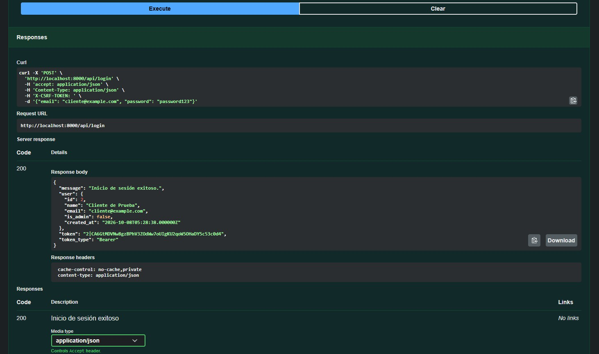

### Usuario autenticado: `GET /api/me`

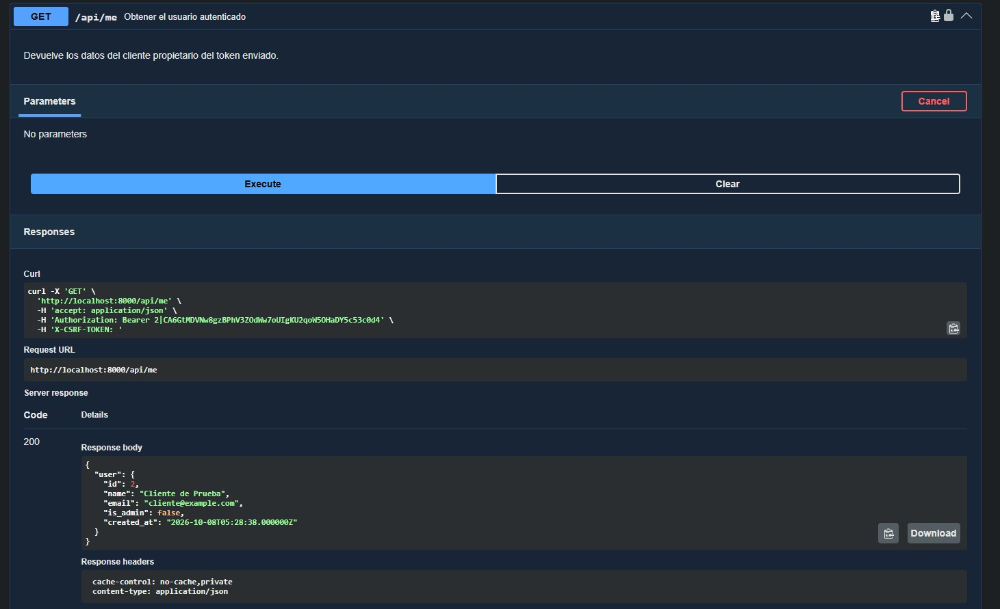

### Catálogo de productos: `GET /api/products`

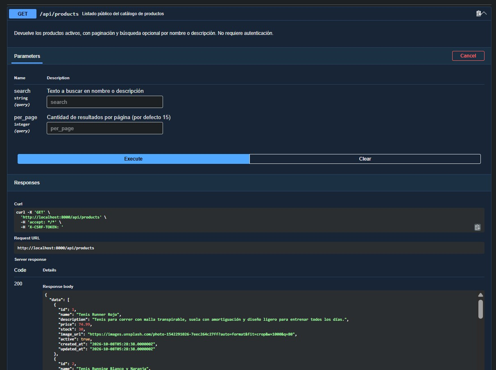

### Crear orden: `POST /api/orders`

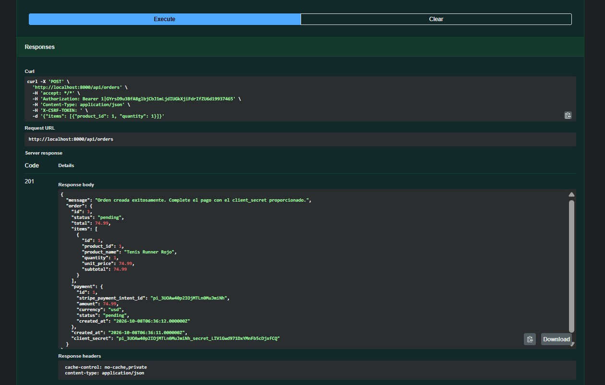

### Confirmar pago con Stripe: `POST /api/orders/{order}/confirm-payment`

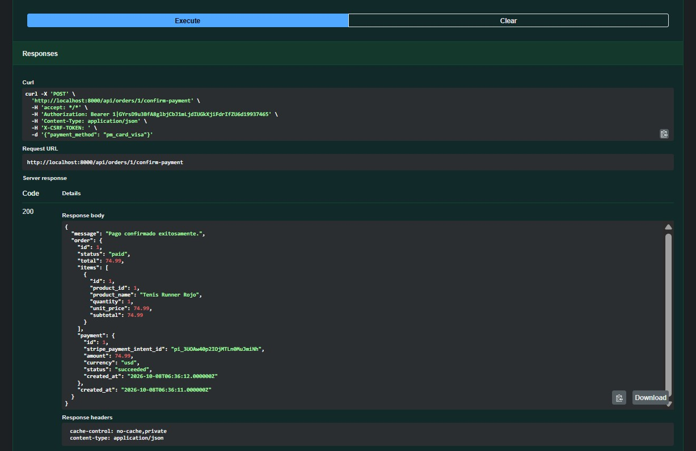

### Historial de órdenes: `GET /api/orders`

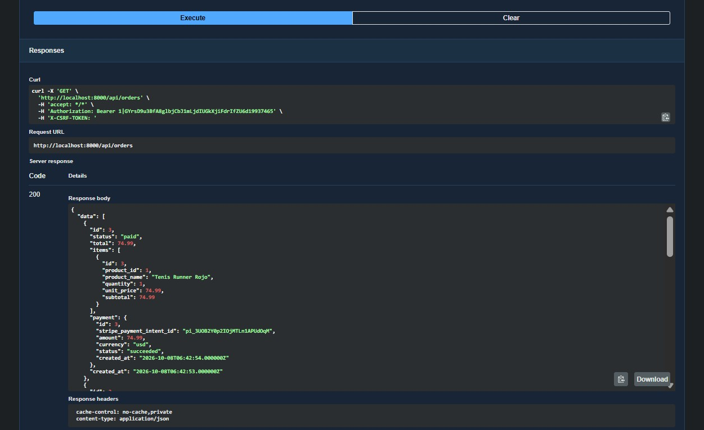

## 2. Flujo completo de compra

### Catálogo

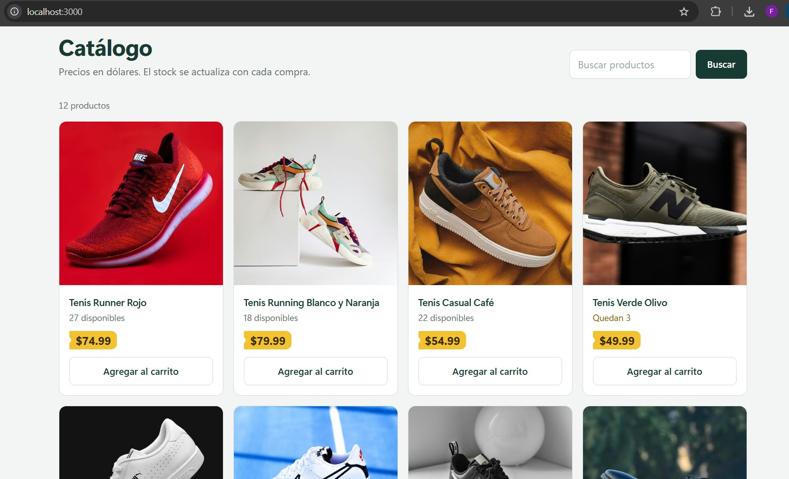

### Detalle de producto

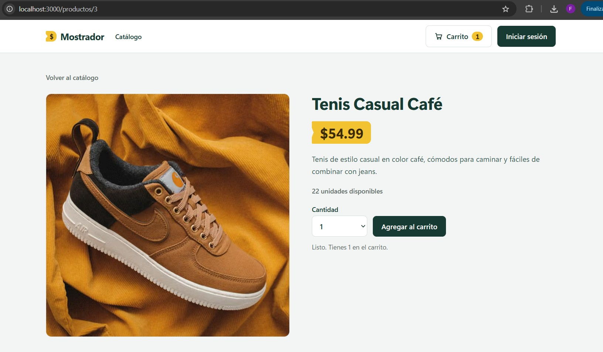

### Carrito

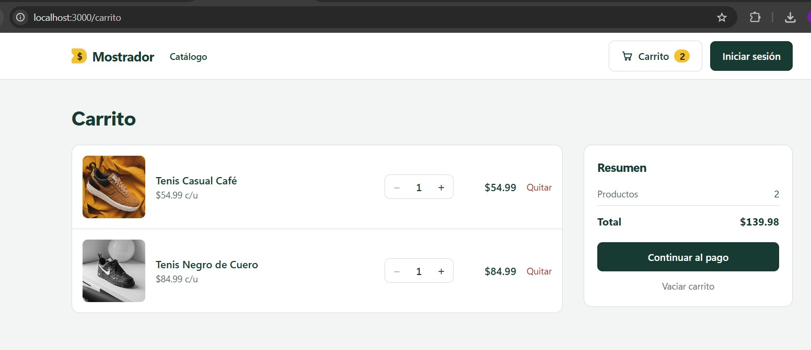

### Inicio de sesión

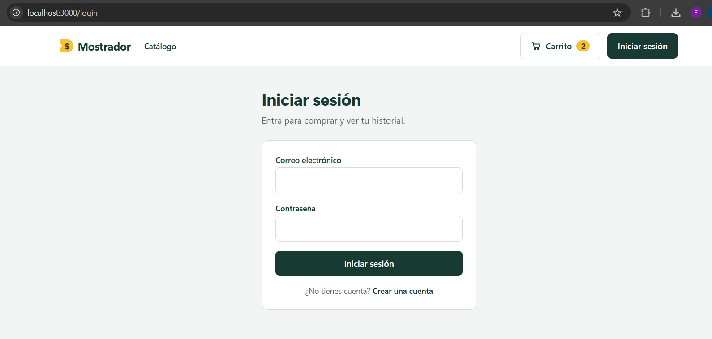

### Checkout

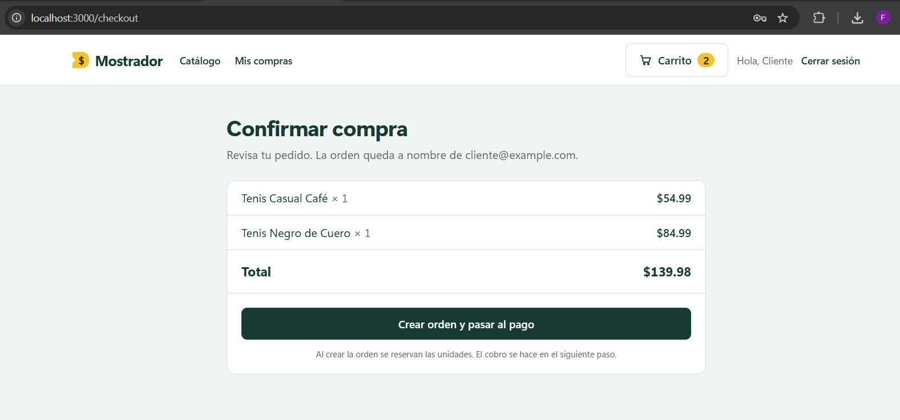

### Pago con tarjeta de prueba de Stripe

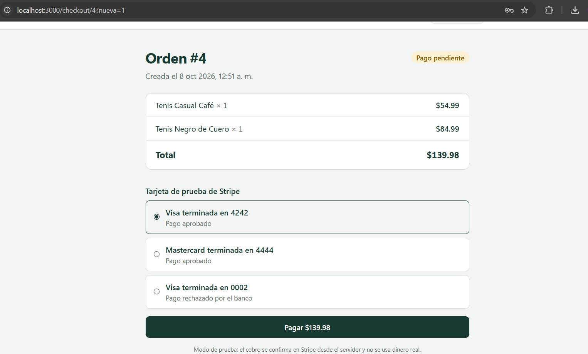

### Compra confirmada

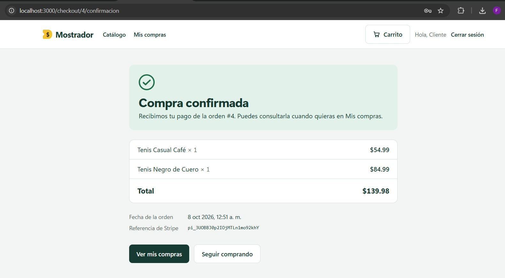

### Historial de compras

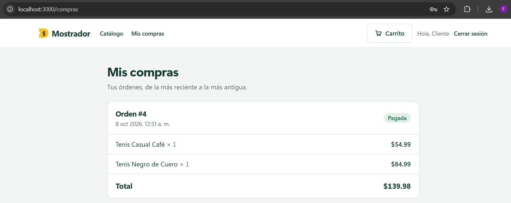

### Pago rechazado

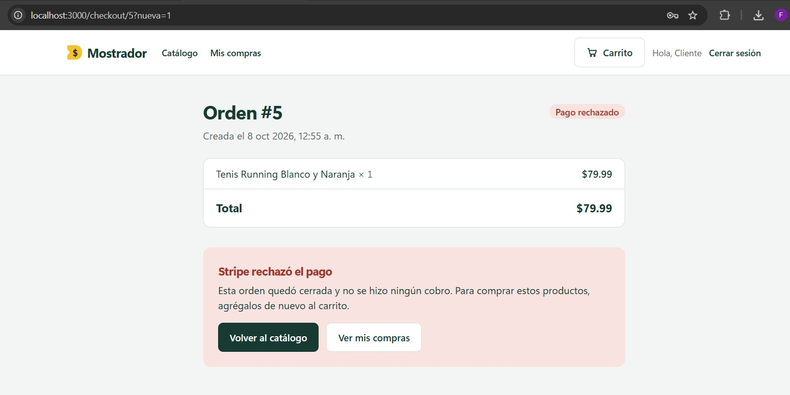

## 3. Rendimiento con Lighthouse

Catálogo medido en modo producción (`npm run build` y `npm run start`).

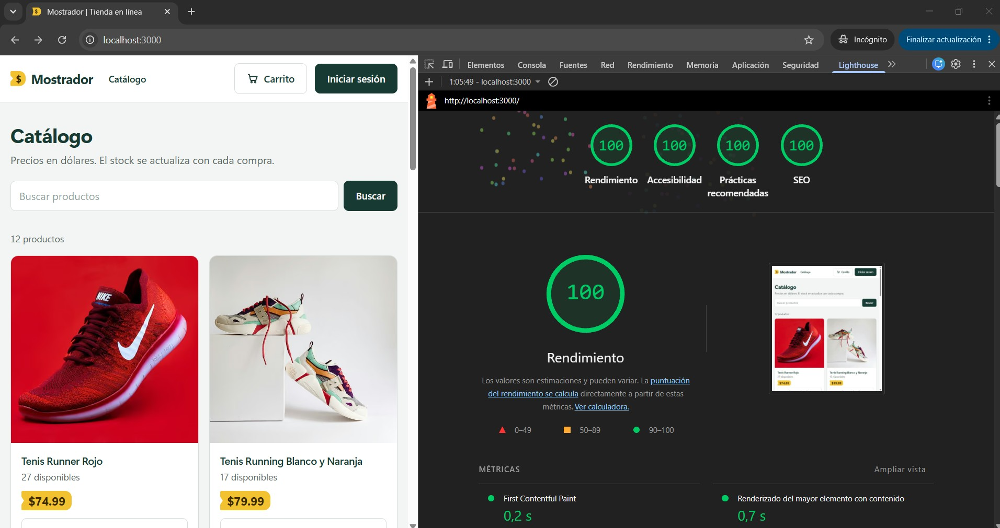
